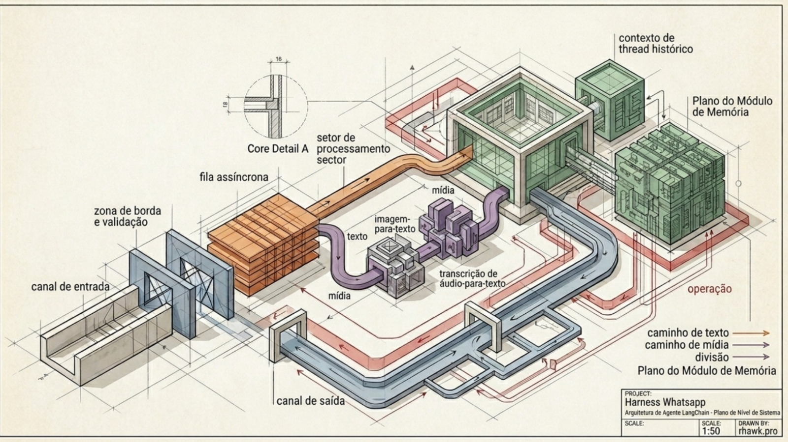

# Chat Nexus

**Versão:** `v0.b1` (Beta 1 — 2026-05-22) · **Stack em produção:** [chat.vsanexus.com](https://chat.vsanexus.com)

Plataforma de WhatsApp + IA multi-tenant, multi-conexão e multi-agente. Operação completa de atendimento humano + agentes LangGraph com governança, NPS, calendar, RBAC, dashboards operacionais e observabilidade — tudo num único stack `FastAPI + Next.js + PostgreSQL` sem dependência de Redis/RabbitMQ.

Originalmente um harness educacional para agentes de WhatsApp com LangGraph, evoluiu para um produto completo de atendimento — preservando o caráter pedagógico do código (cada decisão de arquitetura é explícita e documentada).

---

## Status do projeto

| Métrica | Valor |
|---|---|
| Versão | `v0.b1` (Beta 1) |
| Migrações aplicadas | 71 arquivos (`db/migrations/001` → `074`) |
| Endpoints REST | ~180 |
| Tabelas no schema da app | ~75 |
| Tabelas no schema `auth` (Better Auth) | 12 |
| Agentes catalogados (Python) | 8 templates |
| Frontend | Next.js 16 + React 19 + Tailwind 4 |
| Backend | FastAPI + psycopg async + LangGraph 0.6 |
| Em produção | ✅ 24/7 desde 2026-04-29, 4 réplicas worker |
| Cobertura de testes | ~50% (gate CI) |

---

## Andamento — milestones entregues

### Fundação (Abril 2026)

- ✅ **Webhook Twilio assíncrono** + fila PostgreSQL com `FOR UPDATE SKIP LOCKED`, debounce 2s, retries com backoff exponencial
- ✅ **Worker LangGraph** com ciclo de vida explícito (`AsyncPostgresSaver` + `AsyncPostgresStore` abertos no boot, reutilizados)
- ✅ **Painel admin** Next.js + Better Auth no mesmo PostgreSQL (schema `auth`)
- ✅ **Hardening de produção**: CORS estrito, security headers, fail-fast em invariantes (token ≥32, signature Twilio, FRONTEND_ORIGINS)
- ✅ **Rate limit distribuído** via Postgres (sliding window) — opt-in para multi-instância
- ✅ **Multi-provider WhatsApp**: Twilio sandbox/prod, Evolution API (Baileys), WABA oficial (Embedded Signup OAuth Meta)

### Multi-tenant (M1 — 2026-04-29)

- ✅ Empresa como tenant raiz: `empresa_membro` (FK em todas as tabelas), `is_default`, `role`
- ✅ Bootstrap admin no primeiro `/login` com triple-insert (`auth.user` + `empresa_membro` + `is_superadmin`)
- ✅ Switcher de empresa no sidebar para superadmin/multi-empresa
- ✅ Empresa CRUD em `/companies/[id]` (status, branding, csat config)

### Multi-conexão WhatsApp (M2 — 2026-04-29)

- ✅ Tabela `conexao` com provider (twilio/evolution/waba), credenciais cifradas (Fernet), `connection_state`
- ✅ Worker resolve cliente outbound por `Conexao.provider` via `OutboundClient` Protocol (mesmo contrato para os 3)
- ✅ Webhook por provider: `/webhook/twilio`, `/webhook/evolution`, `/webhook/waba` (HMAC-SHA256)
- ✅ UI `/connections` padrão ZigChat: tabela com badges de estado + modal "+ Nova" com 3 cards (WABA/Evolution/Twilio)

### CRM Light (M3 — 2026-05-02)

- ✅ Tabela `cliente` com nome, telefone, e-mail, endereço, VIP flag, tags, notas internas, dados enriquecidos (Wareline)
- ✅ Form `/clientes/[id]` com 4 abas (Geral / Avançado / Integrações / Histórico)
- ✅ Importação CSV + busca full-text

### Multi-agente IA (Sub-fase A — 2026-05-06)

- ✅ Tabela `agente_ia` com `template_catalog`, `modelo_llm`, `temperatura_override`, `prompt_override` (50k chars), tools opt-in
- ✅ `AgenteRuntime` no worker carrega config da DB sobre o template Python
- ✅ UI `/agents/[slug]` com 5 tabs (Identidade / Prompt / Modelo / Tools / Métricas)

### Menu Chatbot (Sub-fase B+ — 2026-05-06)

- ✅ Paridade ZigChat completa: **12 ações** suportadas (`enviar_mensagem`, `enviar_link`, `chamar_agente`, `transferir_dep`, `pesquisa_csat`, `enviar_template`, `coletar_dados`, etc.)
- ✅ Wizard de coleta multi-pergunta por `menu_item` (validators BR: CPF, CNPJ, telefone, e-mail, data)
- ✅ Templates render: `{{cliente.nome}}`, `{{coleta.X}}`, `{{atendimento.menu_path}}`

### Calendar Agent v2 (S1+S2 — 2026-05-04)

- ✅ Source-of-truth interno em tabela `agendamento` (INSERT local → POST Google → UPDATE com `evento_id_externo`)
- ✅ 7 tools no agente: `get_current_time`, `list_calendars`, `set_active_calendar`, `list_events`, `find_free_slots`, `create_event`, `cancel_event`
- ✅ Hooks `agendamento.criado` / `agendamento.cancelado`
- 🟡 Pendente: regras de negócio (S3), aprovação via WhatsApp (S4), sync periódico + audit (S5)

### Etapa 2 — RBAC + Departamentos + KB + Campanhas (2026-05-05)

- ✅ **RBAC catalogado**: 80+ permissões em `permissao` + perfis system (`Admin`, `Gestor`, `Atendente`) + `perfil_permissao` + `perfil_user`
- ✅ **Departamentos hierárquicos** com herança de regras de roteamento
- ✅ **Base de conhecimento** com pastas + RAG (embeddings via OpenRouter)
- ✅ **Campanhas** (broadcast com templates HSM aprovados)
- ✅ **SSE** (server-sent events) no painel para notificação em tempo real de novos atendimentos

### Sprint Mackenzie Hospital (2026-05-09)

- ✅ Sandbox empresa 999 isolada com dump 3m do ZigChat real
- ✅ 8 agentes hospitalares configurados (Triagem, Atendimento, Exames, Agendamentos, Financeiro, Ouvidoria, NPS, Suporte)
- ✅ 9055 fewshots classificados + 40 sugestões de melhorias com UI de aprovação

### Workflows LangGraph (2026-05-12)

- ✅ 9 workflows ativos em produção (123 nodes total)
- ✅ Fluxo Mackenzie completo: LGPD → nome → menu 8 setores → sub-workflows

### Governança RBAC (Sprint 1+2 — 2026-05-15/17)

- ✅ **Record-level permissions** (`.own` vs `.all`) — atendente vê só os próprios atendimentos
- ✅ **Audit governança** em `audit_governanca` (toda mudança de perfil/depto logada)
- ✅ **Permissions context** no frontend: sidebar/topnav filtram entradas por permissão, 403 sanitiza response

### UX Atendimento (Fase 1.1→1.4 — 2026-05-19)

- ✅ **Abas pessoais** (favoritos / aguardando minha resposta / em andamento)
- ✅ **Tags multi-cor** com edição inline
- ✅ **Notas internas** com menções (@usuário dispara hook)
- ✅ **Painel cliente** lateral mostrando histórico cross-conexão
- ✅ **PWA** com push notification e ícones por status
- ✅ **Transferência por depto** com mensagem WhatsApp automática ao cliente

### Sprint Conexões WABA/Evolution (2026-05-20)

- ✅ **WABA Embedded Signup OAuth Meta** (1-clique) — replicando padrão ZigChat
- ✅ **Evolution auto-provision** com QR no painel + polling até `READY`
- ✅ **Importar instance existente** (modo alternativo) com fallback de API key global
- ✅ **Templates HSM**: form completo (BODY/HEADER/FOOTER/BUTTONS) + submissão Meta + sync status + envio com variáveis substituídas
- ✅ Twilio mantido 100% funcional como 3ª opção

### Sprint A.2 — RLS Postgres real 10/10 (2026-05-22)

- ✅ **4 roles app least-privilege**: `chat_nexus_app` (NOSUPERUSER, NOBYPASSRLS, runtime API+Worker), `chat_nexus_migrator` (DDL), `chat_nexus_readonly` (BI), `chat_nexus_audit` (BYPASSRLS pra compliance)
- ✅ **58 tabelas com RLS + FORCE** — policy `_rls_tenant_match` estrita (`app.empresa_id` vazio = deny)
- ✅ **Middleware FastAPI** seta `app.empresa_id` por request via header `X-Empresa-Id`
- ✅ **Worker** envolve `process_message` em `empresa_scope(message.empresa_id)`
- ✅ **`DATABASE_URL_APP`** em prod aponta pra `chat_nexus_app` — RLS REALMENTE enforcing
- ✅ **Bypass cirúrgico** apenas em cross-tenant legítimos (claim queue, calendar sync, cleanup, webhook lookup, health)
- ✅ **Tests E2E** (`tests/integration/test_rls_isolation.py`) 10/10 PASSED com role app
- ✅ **Hardening DB**: `postgres CONNECTION LIMIT 10`, `chat_nexus_app log_statement=ddl`, event trigger audit em `_ddl_role_audit`
- Runbook completo em [docs/RLS_OPERATIONS.md](docs/RLS_OPERATIONS.md)

### Prompts hospitalares + LGPD (2026-05-21)

- ✅ Metodologia canônica em `docs/agentes/prompts-saude/METODOLOGIA.md` (XML tags, few-shot, ReAct, Constitutional AI, RAG-aware)
- ✅ Template canônico VSA Nexus AI (padrão Claude 4.6/4.7)
- ✅ **Tools LGPD**: `verify_patient_identity` (gate obrigatório antes de dado sensível) + `log_lgpd_event` (auditoria Art. 37)
- ✅ Tabela `lgpd_event_log` com 10 event_types + endpoint admin `/api/lgpd/eventos`
- ✅ Tratamento de sentinel `[NOVO_ATENDIMENTO_TRIAGEM]` (continuidade fluida sem re-saudação)

### Dashboard Operacional + Observabilidade (2026-05-21/22)

- ✅ **Dashboard `/dashboard/atendimento`** como página inicial: 6 KPIs + 3 charts (criados/finalizados, por hora, por depto) + 2 tabelas (aguardando, sem resposta) + sidebar atendentes online
- ✅ **NPS / Pesquisa de satisfação** com captura automática 0-10 ao fechar + comentário follow-up, dashboard `/dashboard/qualidade` com tabela por depto + ranking operadores
- ✅ **Cleanup zumbis automático** a cada 6h no worker (aguardando >48h / sem resposta >24h → `abandonado`)
- ✅ **Métricas operacionais** em `/queue`: idade msg mais antiga, throughput/min, % falhas 24h, latência avg/p95
- ✅ **PATCH parcial** padronizado em todos endpoints (`body.model_dump(exclude_unset=True)`) — permite limpar campos via `null`

---

## Roadmap — próximas sprints

### 🟡 Curto prazo (Beta 2)

- Calendar Agent v2 S3-S5 (regras de negócio, aprovação WhatsApp, sync periódico Google→DB)
- Métricas Prometheus do worker (histograms por etapa: preprocess, LLM, outbound)
- LISTEN/NOTIFY no Postgres para reduzir latência de claim de 1s → ~10ms
- Dashboard IA: custo por agente + breakdown por modelo

### 🔵 Médio prazo (1.0)

- Concorrência intra-worker (`WORKER_CONCURRENCY=N` + lock por `thread_id`)
- Library de templates HSM pré-prontos por vertical (saúde / e-commerce / educação)
- Multi-app Meta (1 Meta App por empresa em vez de 1 global)
- Webhook reverso para hooks `conexao.*`
- Auto-fallback multi-provider (se WABA cair, rotear pra Evolution backup)

### 🟣 Longo prazo

- Suporte oficial Telegram + Instagram (Meta Business Suite)
- Workflows IDE visual drag-and-drop (hoje é JSON)
- Sync periódico template status (cron 1h)
- Dashboard executivo por vertical com KPIs customizados

### ❌ Decisões arquiteturais firmes

- **Sem RabbitMQ** — Postgres queue com `FOR UPDATE SKIP LOCKED` aguenta 10k+ msg/s. Trocar só faria sentido a partir de 500 msg/s sustained. Estamos em ~0.16 msg/s.
- **Sem Redis** — rate limit + cache via tabelas dedicadas (`rate_limit_bucket`). Atomicidade transacional > velocidade que não precisamos.
- **Postgres como queue + checkpointer + store + auth + audit** — 1 backup, 1 monitoramento, 1 cluster.

---

## Stack técnica

| Camada | Tecnologia |
|---|---|
| Frontend | Next.js 16, React 19, Tailwind 4, Better Auth, lucide-react |
| Backend | FastAPI, psycopg 3 async, LangGraph 0.6, LangChain 0.3, structlog |
| LLM | OpenRouter (Claude 4.7, GPT-5, Gemini 2.5) via factory `shared/llm.py` |
| Persistência | PostgreSQL 16 (queue + checkpointer + store + auth + audit) |
| Crypto | Fernet (credenciais de conexão), bcrypt (Better Auth) |
| Mídia | OpenRouter multimodal (imagem/áudio → texto) |
| Observabilidade | OpenTelemetry + Prometheus + structlog JSON |
| Deploy | Dokploy (Docker Compose), também Railway documentado |
| Testes | pytest async-mode, TestClient + httpx + psycopg real, Locust (stress) |

---

## Arquitetura



```text
WhatsApp/Twilio/Evolution/WABA
        ↓
API (/webhook/*) — valida HMAC + rate limit + debounce + lock advisory
        ↓
PostgreSQL message_queue (queued)
        ↓
Worker × 4 réplicas (FOR UPDATE SKIP LOCKED + lease)
        ↓
Preprocess media → LangGraph Agent → checkpointer + store
        ↓
Outbound (Twilio/Evolution/WABA) → mark_done
        ↓
Hooks → DLQ se falhar 3×
```

Separar API e Worker evita bloqueio na borda HTTP. `mark_done` só roda após outbound bem-sucedido — garantia at-least-once.

---

## Quick Start

### 1. Setup

```bash
git clone https://github.com/viniciusandradde/whatsapp-langchain-full.git chat-nexus
cd chat-nexus
make setup
cp .env.example .env
```

Edite `.env`:

```bash
OPENROUTER_API_KEY=sk-or-v1-...
INTERNAL_SERVICE_TOKEN=seu-token-local-32chars-no-min
BETTER_AUTH_SECRET=seu-secret-local
ADMIN_EMAIL=admin@suaempresa.com
ADMIN_PASSWORD=trocar-no-primeiro-login
TWILIO_OUTBOUND_MODE=mock
WARELINE_ENCRYPTION_KEY=  # gere com: python -c "from cryptography.fernet import Fernet; print(Fernet.generate_key().decode())"
```

`INTERNAL_SERVICE_TOKEN`, `BETTER_AUTH_SECRET` e `WARELINE_ENCRYPTION_KEY` precisam estar preenchidos mesmo localmente.

### 2. Suba o stack

```bash
make up
# db + api + worker + frontend
```

Acesse:
- Painel: http://localhost:3000
- API: http://localhost:8000
- Health: http://localhost:8000/health

### 3. Primeiro login

Abra http://localhost:3000/login e use `ADMIN_EMAIL` / `ADMIN_PASSWORD`. O bootstrap cria automaticamente:
- Linha em `auth.user` com `is_superadmin=true`
- Linha em `empresa_membro` (empresa_id=1, role=admin)
- Token Better Auth válido

### 4. Teste rápido

```bash
curl -X POST "http://localhost:8000/webhook/sync?agent=vsa_tech" \
  -H "Content-Type: application/json" \
  -d '{"phone":"+5511999999999","message":"Olá!"}'
```

---

## Comandos úteis

```bash
make help              # lista todos os targets
make api               # API local (uvicorn --reload)
make worker            # Worker local
make frontend          # Next.js dev server
make migrate           # aplica migrations pendentes
make check             # ruff + pyright (sem alterar arquivos)
make test              # suite normal (exclui docker_demo)
make test-live         # testes live OpenRouter (OPENROUTER_LIVE_TESTS=1)
make test-demo         # testes Docker realísticos (docker_demo)
make ci                # check + suite normal (o que CI roda)
make stress-evolution  # Locust contra /webhook/evolution
make stress-twilio     # Locust contra /webhook/twilio
make logs              # docker compose logs -f
make reset             # rebuild Docker do zero
```

---

## Hardening de produção

Em `ENVIRONMENT=production`, o startup faz **fail-fast** se qualquer destes invariantes falhar:

| Invariante | Variável | Critério |
|---|---|---|
| Token interno presente | `INTERNAL_SERVICE_TOKEN` | não-vazio |
| Token forte em prod | `INTERNAL_SERVICE_TOKEN` | ≥ 32 caracteres |
| Signature obrigatória | `VALIDATE_TWILIO_SIGNATURE` | `true` |
| CORS configurado | `FRONTEND_ORIGINS` | pelo menos 1 origem |

Cabeçalhos de segurança automáticos: `X-Content-Type-Options: nosniff`, `X-Frame-Options: DENY`, `Referrer-Policy: no-referrer`, `Strict-Transport-Security` (1 ano em prod).

---

## Documentação

- [Arquitetura](docs/ARCHITECTURE.md) — fluxo de dados + endpoints
- [Primeiros Passos](docs/GETTING_STARTED.md)
- [Banco de Dados](docs/DATABASE.md) — schema + queries de inspeção
- [Criando Agentes](docs/ADDING_AGENTS.md) — contrato + exemplos
- [Integração Twilio](docs/TWILIO.md)
- [Integração Evolution API](docs/EVOLUTION.md)
- [Autenticação](docs/AUTH.md) — Better Auth + user status + reset sem SMTP + SSO Google
- [NPS / Pesquisa de Satisfação](docs/NPS.md)
- [LangSmith](docs/LANGSMITH.md) — datasets + LLM-as-judge
- [Deploy Dokploy](docs/DOKPLOY.md) · [Deploy genérico](docs/DEPLOY.md) · [Railway](docs/RAILWAY.md)
- [Stress testing](docs/STRESS_TESTING.md)
- [Prompts saúde — metodologia canônica](docs/agentes/prompts-saude/METODOLOGIA.md)
- [Padrão PATCH parcial](docs/dev/PATCH_PATTERN.md)
- [RLS Operations Runbook](docs/RLS_OPERATIONS.md) — roles, troubleshooting, rotação de senha, emergency bypass, incident response LGPD

---

## Licença

[VSA Tech Community License](LICENSE) — uso restrito a membros da comunidade [VSA Tech](https://chat.vsanexus.com).

---

**Mantido por** [VSA Tecnologia](https://chat.vsanexus.com) · Produção 24/7 em [chat.vsanexus.com](https://chat.vsanexus.com) · Issues e PRs no [GitHub](https://github.com/viniciusandradde/whatsapp-langchain-full)
