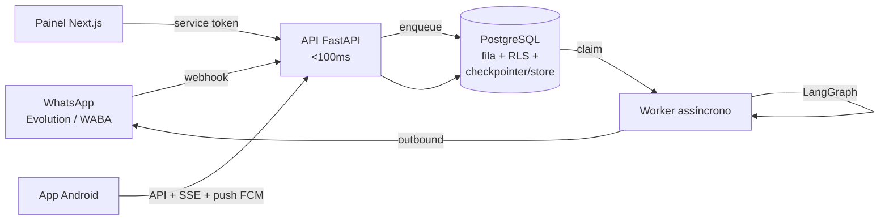

# Chat Nexus

Plataforma de atendimento WhatsApp **multi-tenant** com agentes de IA (LangGraph), painel administrativo (Next.js) e app Android — em produção, num único stack `FastAPI + PostgreSQL + Next.js`, sem Redis/RabbitMQ.

## Arquitetura

Dois processos Python compartilham o Postgres — e o Postgres **é** a fila:

- **API (FastAPI)** — borda HTTP. Valida o webhook (Evolution / WABA; Twilio legado), aplica rate limit por telefone, normaliza o payload e enfileira em `message_queue`. Responde em <100ms; nunca invoca o agente inline.
- **Worker assíncrono** — faz claim com `FOR UPDATE SKIP LOCKED` + lease, pré-processa mídia (imagem/áudio/documento → texto), invoca o agente LangGraph e só marca `done` depois do envio outbound bem-sucedido (entrega at-least-once). Retry com backoff até `MAX_ATTEMPTS`.
- **LangGraph** — checkpointer (`AsyncPostgresSaver`) e store semântico (`AsyncPostgresStore`) abertos uma vez no boot do worker; histórico por `thread_id = telefone:agente`, memória cross-thread por usuário.
- **Frontend (Next.js)** — painel administrativo com Better Auth (schema `auth` no mesmo Postgres), RBAC com governança record-level e white-label por empresa.
- **Multi-tenant com RLS forçado** — Row-Level Security estrita em todas as tabelas com `empresa_id` (runbook em [docs/RLS_OPERATIONS.md](docs/RLS_OPERATIONS.md)).


```mermaid
flowchart LR
    W[WhatsApp<br/>Evolution / WABA] -->|webhook| API[API FastAPI<br/>&lt;100ms]
    API -->|enqueue| PG[(PostgreSQL<br/>fila + RLS +<br/>checkpointer/store)]
    PG -->|claim| WK[Worker assíncrono]
    WK -->|LangGraph| WK
    WK -->|outbound| W
    FE[Painel Next.js] -->|service token| API
    APP[App Android] -->|API + SSE + push FCM| API
    API --> PG
```

## Destaques

- **Multi-empresa** com RLS forçado no Postgres (4 roles de aplicação, policies estritas)
- **Multi-conexão**: Evolution API e WhatsApp Cloud API (WABA, com Embedded Signup); Twilio como legado
- **Agentes de IA por empresa**: prompt versionado com diff e restauração, catálogo de modelos via OpenRouter, tools de calendário (Google Calendar), memória semântica e few-shot learning opt-in a partir de atendimentos bem avaliados
- **Menu chatbot** (URA de texto) com wizard de coleta e triagem por departamento
- **Atendimento humano**: fila por departamento, transferência (atendente/departamento), notas internas, tags, distribuição com turnos/jornada, transcrição de áudio para o operador
- **Leitura de documentos** recebidos: PDF, DOCX, XLSX (o agente sempre recebe texto)
- **Campanhas / disparador em massa** com anti-ban: teto diário por conexão, aquecimento, jitter, pausas periódicas e pool de conexões + extensão Chrome de captura (`extension/`)
- **NPS/CSAT** automático ao fechar atendimento, com relatórios e ranking de operadores ([docs/NPS.md](docs/NPS.md))
- **Base de conhecimento com RAG** (chunks vetorizados, busca no painel)
- **Relatórios**: uso mensal por cliente em PDF enviado pelo WhatsApp, resumo diário de atendimentos e relatório de produção com checagens determinísticas (IA só redige)
- **App Android** (`android/`): conversas via SSE, push FCM, ações de atendimento
- **White-label por empresa**: logo, nome de marca e cores próprias no painel
- **Backup em 3 cópias**: dump no host + espelho externo (Google Drive via rclone) + espelho de dev, com verificação de integridade ([docs/BACKUP.md](docs/BACKUP.md))
- **Operabilidade**: retries com DLQ para hooks, rate limits distribuídos opcionais, correlation id em todo request, auditoria de login, teto de gasto de IA por empresa

## Como rodar (dev)

Pré-requisitos: Docker, `uv` e Node 20+.

```bash
make setup      # uv venv + install (dev extras)
make up         # stack completa: db + api + worker + frontend
make migrate    # aplica as migrations SQL de db/migrations/
```

Para iterar fora do Docker:

```bash
make db         # só o Postgres
make api        # uvicorn com --reload na porta 8000
make worker     # loop do worker
make frontend   # Next.js dev (precisa de frontend/.env.local)
make dev        # LangGraph Studio para iterar no agente
```

Qualidade e testes:

```bash
make check      # ruff + pyright
make ci         # check + pytest com gate de coverage 50% (o CI de PR roda só o check)
make test       # suite completa (sem markers docker_demo/twilio_real)
```

Configuração via `.env` (documentada em `.env.example`); `INTERNAL_SERVICE_TOKEN` e `BETTER_AUTH_SECRET` são obrigatórios mesmo em dev.

## Stack

| Camada | Tecnologia |
|---|---|
| Backend | Python ≥3.11 (via `uv`), FastAPI 0.129, psycopg 3.3 async |
| Agentes | LangGraph 1.1 + LangChain 1.2, LLMs via OpenRouter |
| Banco | PostgreSQL — fila, RLS multi-tenant, checkpointer/store do LangGraph, schema `auth` |
| Frontend | Next.js 16.1 + React 19.2 + Tailwind 4 + Better Auth |
| Infra | Docker Compose, migrations SQL próprias (`db/migrations/`, 168 arquivos numerados até `175`) |
| Observabilidade | structlog + LangSmith (datasets/eval); Langfuse self-host opcional |

## Estrutura do repositório

```
src/whatsapp_langchain/
  server/     # API FastAPI (webhooks, rotas /api/* do painel)
  worker/     # loop assíncrono: claim da fila, mídia, agente, outbound
  agents/     # catálogo plug-in de agentes (catalog/<agent_id>/)
  shared/     # config, fila, LLM factory, integrações, helpers
frontend/     # painel Next.js (Better Auth, RBAC, white-label)
android/      # app Android do operador
extension/    # extensão Chrome do disparador (captura de contatos)
db/migrations/  # migrations SQL da aplicação
docs/         # documentação de referência
stress/       # perfil Locust de teste de carga
patch/        # drop-ins por fase (origem didática, ver abaixo)
```

## Origem didática

O repositório nasceu como harness de ensino de agentes WhatsApp em fases (`Fase_1` → `Fase_4`); essa origem continua registrada no histórico e nos drop-ins por fase em [`patch/`](patch/README.md).

## Documentação

| Doc | Conteúdo |
|---|---|
| [docs/ARCHITECTURE.md](docs/ARCHITECTURE.md) | Fluxo de dados completo + inventário de endpoints |
| [docs/DATABASE.md](docs/DATABASE.md) | Schema + queries prontas de inspeção |
| [docs/ADDING_AGENTS.md](docs/ADDING_AGENTS.md) | Contrato de agente (catálogo plug-in) |
| [docs/EVOLUTION.md](docs/EVOLUTION.md) | Provider Evolution API |
| [docs/WABA_SETUP.md](docs/WABA_SETUP.md) | App Meta + Embedded Signup passo a passo |
| [docs/AUTH.md](docs/AUTH.md) | Better Auth, status de usuário, reset sem SMTP, SSO Google |
| [docs/NPS.md](docs/NPS.md) | Pesquisa de satisfação: captura, relatórios, dashboard |
| [docs/RLS_OPERATIONS.md](docs/RLS_OPERATIONS.md) | Runbook do Row-Level Security |
| [docs/BACKUP.md](docs/BACKUP.md) | Backup do banco em 3 cópias |
| [docs/DOKPLOY.md](docs/DOKPLOY.md) | Deploy via Dokploy |
| [docs/STRESS_TESTING.md](docs/STRESS_TESTING.md) | Testes de carga com Locust |

## Licença

Uso restrito a membros da comunidade VSA Tech — veja [LICENSE](LICENSE).
