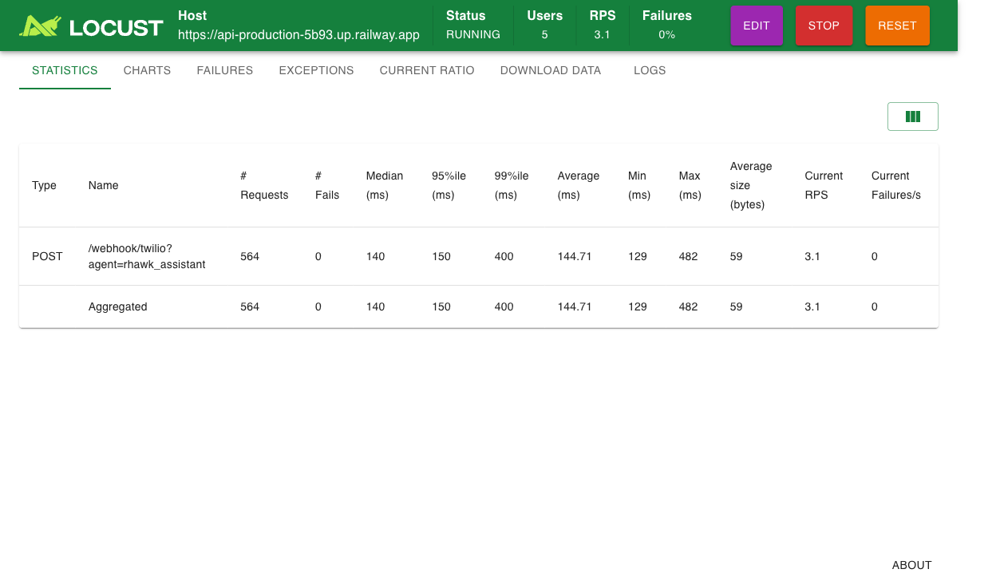
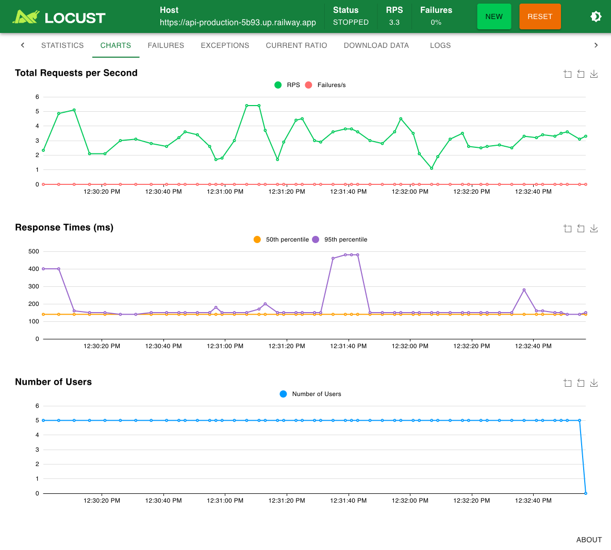
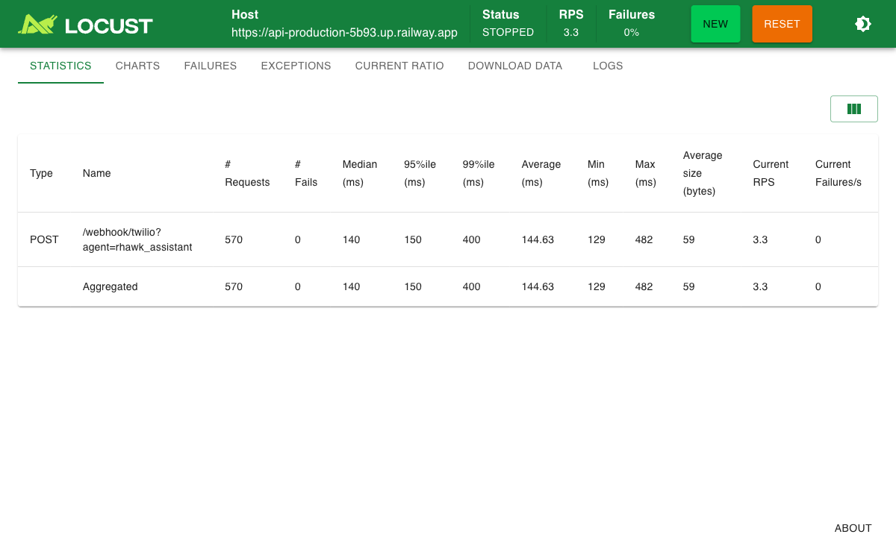
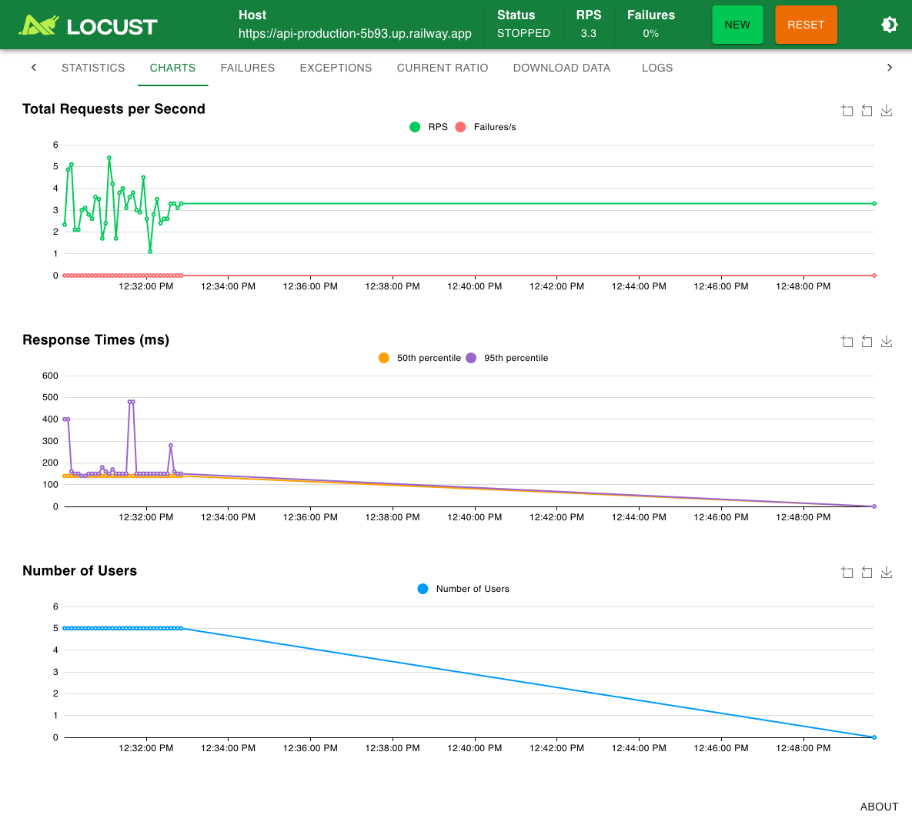

# Stress Testing

## Por que testar carga?

Testes unitários validam que cada função faz o que deveria. Testes de carga validam que o **harness inteiro** sobrevive quando muitos usuários chegam ao mesmo tempo.

Sem testes de carga, você só descobre gargalos em produção — quando já é tarde demais. Com eles, você pode:

- Encontrar o ponto de ruptura antes que os usuários encontrem
- Validar que a arquitetura assíncrona (fila + worker) realmente escala
- Medir latências reais sob pressão (p50, p95, p99)
- Garantir que rate limiting, debounce e backpressure funcionam como esperado

**Diferença fundamental:**

| Aspecto | Teste unitário | Teste de carga |
|---------|---------------|----------------|
| Escopo | Uma função/módulo | Harness completo |
| Objetivo | Corretude lógica | Performance e estabilidade |
| Duração | Milissegundos | Minutos |
| Dependências | Mockadas | Reais (DB, API, LLM) |

## Cenários disponíveis

O `locustfile.py` define duas classes de usuários virtuais, cada uma simulando um padrão de uso diferente:

| Cenário | Classe | Endpoint | Peso | Wait Time | Assinatura |
|---------|--------|----------|------|-----------|------------|
| Webhook Async | `TwilioWebhookUser` | `/webhook/twilio` | 10 (normal) / 1 (longo) | 1-3s | Sim (HMAC-SHA1) |
| Burst | `BurstUser` | `/webhook/twilio` | 1 | 5-15s (entre rajadas) | Sim |

### Webhook Async (TwilioWebhookUser)

Cenário principal. Simula usuários enviando mensagens pelo webhook do Twilio com assinatura HMAC-SHA1 válida. A API enfileira a mensagem e retorna `200` imediatamente — o worker processa depois.

### Burst (BurstUser)

Simula rajadas de 5-20 mensagens com intervalo de 0.1-0.5s entre elas (como um usuário colando várias linhas). Estressa rate limiting, crescimento de fila e estabilidade do banco sob muitas escritas simultâneas.

## Como executar

### Localmente (sem Docker)

```bash
cd /caminho/para/whatsapp-langchain/stress
uv venv
source .venv/bin/activate
uv pip install -r requirements.txt
export TWILIO_AUTH_TOKEN=seu_token
export TWILIO_WEBHOOK_URL=http://localhost:8000
locust
```

Acesse http://localhost:8089 para a interface web do Locust.

### Via Docker Compose (profile testing)

O serviço `stress` está configurado com o profile `testing`, então não sobe junto com os serviços principais. Para iniciá-lo:

```bash
docker compose --profile testing up stress
```

Isso sobe o Locust apontando para o serviço `api` via rede interna do Compose. Acesse http://localhost:8089.

> **Nota:** As variáveis `TWILIO_AUTH_TOKEN` e `TWILIO_WEBHOOK_URL` já estão configuradas no `docker-compose.yml`. O token vem do `.env` (ou usa `test-token` como fallback).

### Modo headless (CI/CD)

Para rodar sem interface gráfica (útil em pipelines de CI):

```bash
locust --headless -u 50 -r 5 -t 120s -f locustfile.py --host http://localhost:8000
```

Parâmetros:
- `-u 50`: 50 usuários simultâneos
- `-r 5`: ramp-up de 5 usuários por segundo
- `-t 120s`: duração total de 120 segundos
- `--host`: URL base da API

### Contra o Railway (stack real)

Para testar contra o ambiente real no Railway, é necessário preparar o ambiente **antes** de rodar o Locust. Sem essa preparação, o stress test pode enviar centenas de mensagens reais pelo Twilio (custo!) ou ser bloqueado pelo rate limit.

#### 1. Preparar variáveis no Railway

Acesse o dashboard do Railway e ajuste as variáveis abaixo **antes** de iniciar o teste:

| Serviço | Variável | Alterar para | Valor normal | Por quê |
|---------|----------|-------------|--------------|---------|
| **worker** | `TWILIO_OUTBOUND_MODE` | `mock` | `real` | Impede que o Worker envie mensagens reais pelo Twilio durante o teste. Sem isso, cada mensagem processada gera uma chamada real ao Twilio (custo + spam). |
| **worker** | `LLM_RATE_LIMIT_REQUESTS_PER_SECOND` | `5` | `0.5` | Aumenta o throughput do LLM para drenar a fila mais rápido durante o teste. |
| **worker** | `LLM_RATE_LIMIT_MAX_BURST` | `20` | `10` | Permite rajadas maiores ao LLM, compatível com o cenário BurstUser. |
| **api** | `RATE_LIMIT_PER_HOUR` | `500` (ou mais) | `30` | O rate limit padrão (30/hora por telefone) bloqueia rapidamente os usuários virtuais do Locust. Aumente para o teste não ser interrompido por 429s. |

> **Importante:** Após o teste, **reverta todas as variáveis** para os valores normais. Em especial, `TWILIO_OUTBOUND_MODE` deve voltar para `real` para que o bot funcione normalmente.

#### 2. Obter as credenciais

Você precisa de dois valores do Railway (disponíveis nas variáveis do serviço **API**):

- `TWILIO_AUTH_TOKEN` — mesmo token configurado na API (necessário para gerar assinaturas HMAC-SHA1 válidas)
- `TWILIO_WEBHOOK_URL` — URL pública da API (ex: `https://api-production-xxxx.up.railway.app`)

#### 3. Rodar o teste

```bash
cd stress
source .venv/bin/activate

# Configura com os valores do Railway
export TWILIO_AUTH_TOKEN=token_do_railway
export TWILIO_WEBHOOK_URL=https://api-production-xxxx.up.railway.app

# Com Web UI (recomendado para primeira vez)
# IMPORTANTE: o host DEVE incluir https:// — sem isso o Locust falha com MissingSchema
locust -f locustfile.py --host https://api-production-xxxx.up.railway.app

# Ou headless
locust -f locustfile.py \
  --host https://api-production-xxxx.up.railway.app \
  -u 5 -r 1 --run-time 3m --headless --only-summary \
  TwilioWebhookUser BurstUser
```

#### 4. Após o teste — reverter variáveis

Checklist de reversão no Railway:

| Serviço | Variável | Reverter para |
|---------|----------|--------------|
| **worker** | `TWILIO_OUTBOUND_MODE` | `real` |
| **worker** | `LLM_RATE_LIMIT_REQUESTS_PER_SECOND` | `0.5` |
| **worker** | `LLM_RATE_LIMIT_MAX_BURST` | `10` |
| **api** | `RATE_LIMIT_PER_HOUR` | `30` |

> **Cuidado:** Se esquecer de reverter `TWILIO_OUTBOUND_MODE` para `real`, o bot para de responder no WhatsApp (as mensagens são processadas mas as respostas são descartadas).

## Cenários recomendados

| Cenário | Usuários | Ramp-up | Duração | Objetivo |
|---------|----------|---------|---------|----------|
| Baseline | 10 | 2/s | 60s | Validar funcionamento básico |
| Normal | 50 | 5/s | 120s | Carga típica de operação |
| Pico | 200 | 10/s | 300s | Simular horário de pico |
| Stress | 500 | 20/s | 300s | Encontrar ponto de ruptura |

Comece pelo **Baseline** para garantir que tudo funciona, depois escale gradualmente. Se o Baseline já mostra erros, corrija antes de ir para cenários maiores.

## Interpretando resultados

### Métricas-chave

- **RPS (Requests per Second)**: throughput da API — quantas requisições ela consegue processar por segundo
- **p50/p95/p99 latência**: tempo de resposta em percentis. p50 = mediana, p95 = "quase todo mundo", p99 = piores casos
- **Taxa de erros**: percentual de respostas 4xx/5xx. Em operação normal, deve ser próximo de 0%
- **Queue drain rate**: velocidade com que o worker processa a fila. Se a fila só cresce, o worker está mais lento que a entrada

## Identificando gargalos

Quando os resultados não estão bons, use esta tabela para diagnosticar:

| Sintoma | Causa provável | O que verificar |
|---------|---------------|-----------------|
| Latência alta no enqueue | API lenta | Conexão com o banco de dados, pool size |
| Fila cresce sem drenar | Worker lento | Rate limit do LLM, quantidade de workers |
| Erros de conexão | DB saturado | `pool_size` no PostgreSQL, conexões abertas |
| Erros 429 do OpenRouter | LLM throttled | Ajustar `LLM_RATE_LIMIT_*` no `.env` |
| Erros 403 no webhook | Assinatura inválida | `TWILIO_AUTH_TOKEN` correto e consistente |

## Contextos de uso

1. **Educacional local**: rode o cenário Baseline com a stack Docker completa e observe o comportamento da fila assíncrona — como a API enfileira rápido e o Worker drena no ritmo do LLM. Este é o melhor exercício para entender *por que* filas assíncronas existem.

2. **Validação operacional**: rode o cenário async com assinatura válida contra o Railway real antes de ir para produção. Valide que o harness aguenta a carga esperada sem acumular backlog na fila.

---

## Resultados reais — Railway staging (08/03/2026)

Teste executado contra o ambiente de staging no Railway para validar a capacidade do hardware antes de promover para produção.

### Configuração do teste

| Parâmetro | Valor |
|-----------|-------|
| **Host** | `https://api-production-5b93.up.railway.app` |
| **Cenários** | `TwilioWebhookUser` + `BurstUser` |
| **Usuários** | 5 simultâneos |
| **Spawn rate** | 1 user/s |
| **Duração** | 3 minutos |
| **Assinatura** | HMAC-SHA1 válida (mesmo token da API) |

### Configuração do ambiente

| Serviço | Config |
|---------|--------|
| **API** | 2 réplicas, `RATE_LIMIT_PER_HOUR=200` |
| **Worker** | 1 réplica, `TWILIO_OUTBOUND_MODE=mock`, `LLM_RATE_LIMIT_REQUESTS_PER_SECOND=5`, `LLM_RATE_LIMIT_MAX_BURST=20` |
| **DB** | pgvector/pg16, volume persistente |
| **LLM** | `x-ai/grok-4.1-fast` via OpenRouter |

### Resultados da API (Locust)



| Métrica | Valor |
|---------|-------|
| Total de requests | **564** |
| Falhas | **0 (0%)** |
| Throughput médio | **3.1-3.5 req/s** |
| Latência p50 | **140ms** |
| Latência p95 | **150ms** |
| Latência p99 | **400ms** |
| Latência mínima | **129ms** |
| Latência máxima | **482ms** |

### Gráficos de performance



**Total Requests per Second**: RPS variou entre 2-5 req/s, com média estável em ~3.5 req/s. A variação é normal — o BurstUser envia rajadas (picos) seguidas de pausas (vales). Zero falhas durante todo o teste (linha vermelha em 0).

**Response Times**: p50 (amarelo) estável em ~140ms durante todo o teste. p95 (roxo) majoritariamente em ~150ms com picos esporádicos de até ~480ms. Os picos provavelmente são causados por GC ou cold starts nas réplicas da API.

**Number of Users**: 5 usuários constantes durante todo o teste, com ramp-up gradual no início.

### Comportamento do Worker

O Worker processou mensagens sequencialmente, uma por vez:

- **Taxa de processamento**: ~10-12 mensagens/min (~1 msg a cada 4-6s)
- **Gargalo**: latência do LLM (grok-4.1-fast leva 3-8s por resposta)
- **Taxa de entrada**: ~200 msgs/min (3.5 req/s, com debounce agrupando algumas)
- **Resultado**: fila cresceu ~190 msgs/min durante o teste

O Worker não consegue drenar a fila na mesma velocidade que 5 usuários enviam. Isso é esperado com 1 Worker sequencial — o gargalo não é o hardware (CPU/memória/DB), e sim a **latência do LLM externo**.

### Conclusões

1. **API**: hardware excelente. 140ms de mediana com zero erros sob 3.5 req/s. As 2 réplicas aguentam a carga sem problemas.

2. **DB**: nenhum erro de conexão ou timeout. O PostgreSQL aguentou as escritas simultâneas na fila sem saturar.

3. **Worker**: o gargalo é o LLM, não o hardware. Para aumentar a capacidade de drenagem da fila, as opções são:
   - Escalar para mais réplicas do Worker (paralelismo de processamento)
   - Usar um modelo mais rápido (menor latência por mensagem)
   - Aceitar o acúmulo sabendo que a fila drena quando a carga diminui

4. **Rate limit**: 200/hora por telefone foi suficiente para o teste. Em produção, o valor ideal depende do uso esperado — comece conservador (30-50) e ajuste baseado em métricas reais.

### Escalabilidade do Worker (educacional + production-ready)

Quando a fila cresce de forma contínua, o ponto principal não é "deixar o worker async" (ele já usa I/O async), e sim aumentar capacidade efetiva de processamento.

#### Estratégia recomendada por etapas

| Etapa | Ação | Complexidade | Risco | Quando usar |
|-------|------|--------------|-------|-------------|
| 1 | Aumentar réplicas do Worker (escala horizontal) | Baixa | Baixo | Primeira resposta ao backlog |
| 2 | Usar modelo LLM mais rápido (menor latência por resposta) | Baixa | Médio (qualidade/custo) | Quando o gargalo for tempo de inferência |
| 3 | Adicionar concorrência interna por processo (N inflight com limite) | Média | Médio/Alto | Quando réplicas não forem suficientes |
| 4 | Introduzir controle de serialização por `thread_id` | Média | Baixo | Obrigatório ao elevar concorrência para preservar ordem por conversa |

#### Regra prática

1. Comece por **réplicas** (2, 3, 4...) e meça `queue_drain_rate` vs `queue_ingress_rate`.
2. Se ainda acumular fila no pico esperado, reduza latência média do LLM (modelo/parâmetros).
3. Só depois implemente concorrência interna no worker, com limite explícito para evitar sobrecarga externa.
4. Ao subir concorrência, garanta processamento ordenado por conversa (`thread_id`) para não quebrar coerência do contexto.

#### Meta operacional

Para declarar capacidade adequada, a taxa de drenagem da fila deve ser maior ou igual à taxa de entrada durante o pico alvo por pelo menos 15 minutos, sem crescimento sustentado de backlog.

### Como reproduzir este teste

```bash
# 1. Instalar dependências (ambiente virtual isolado)
cd stress
uv venv
source .venv/bin/activate
uv pip install -r requirements.txt

# 2. Configurar variáveis (usar os mesmos tokens do Railway)
export TWILIO_AUTH_TOKEN=<token da sua conta Twilio>
export TWILIO_WEBHOOK_URL=https://sua-api.up.railway.app

# 3. Rodar com dashboard web (recomendado para primeira vez)
locust -f locustfile.py \
  --host https://sua-api.up.railway.app \
  -u 5 -r 1 --run-time 3m --autostart \
  TwilioWebhookUser BurstUser
# Acesse http://localhost:8089 para ver o dashboard

# 4. Rodar headless (para CI ou automação)
locust -f locustfile.py \
  --host https://sua-api.up.railway.app \
  -u 5 -r 1 --run-time 3m --headless --only-summary \
  TwilioWebhookUser BurstUser
```

---

## Comparação: 1 Worker vs 4 Workers (08/03/2026)

Segundo teste executado imediatamente após o primeiro, com a única mudança sendo o número de réplicas do Worker (1 → 4). Objetivo: validar que escala horizontal resolve o gargalo de drenagem da fila.

### Configuração do teste (idêntica ao anterior)

| Parâmetro | Valor |
|-----------|-------|
| **Host** | `https://api-production-5b93.up.railway.app` |
| **Cenários** | `TwilioWebhookUser` + `BurstUser` |
| **Usuários** | 5 simultâneos |
| **Spawn rate** | 1 user/s |
| **Duração** | 3 minutos |

### Mudança no ambiente

| Serviço | Antes | Depois |
|---------|-------|--------|
| **Worker** | 1 réplica | **4 réplicas** |
| Demais serviços | Sem alteração | Sem alteração |

### Resultados da API (Locust) — 4 Workers



| Métrica | 1 Worker | 4 Workers | Variação |
|---------|----------|-----------|----------|
| Total de requests | 564 | **570** | +1% |
| Falhas | 0 (0%) | **0 (0%)** | — |
| Throughput médio | 3.1-3.5 req/s | **3.3 req/s** | Estável |
| Latência p50 | 140ms | **140ms** | Igual |
| Latência p95 | 150ms | **150ms** | Igual |
| Latência p99 | 400ms | **400ms** | Igual |
| Latência mínima | 129ms | **129ms** | Igual |
| Latência máxima | 482ms | **482ms** | Igual |

**Conclusão da API**: métricas idênticas. Isso confirma que a API nunca foi o gargalo — as 2 réplicas da API aguentam a carga independente de quantos Workers existem.

### Gráficos de performance — 4 Workers



**Total Requests per Second**: RPS estabilizou em ~3.3 req/s após o ramp-up inicial. Variação menor que no teste com 1 Worker, indicando comportamento mais previsível. Zero falhas durante todo o teste.

**Response Times**: p50 estável em ~140ms. p95 mostrou picos no início (até ~480ms durante ramp-up) mas estabilizou em ~150ms. Comportamento consistente com o teste anterior — os picos iniciais são causados por cold starts ou GC nas réplicas da API.

**Number of Users**: 5 usuários constantes com ramp-down gradual no final do teste.

### Comportamento do Worker — 4 Workers

Com 4 réplicas, os Workers processaram mensagens **em paralelo**:

| Métrica | 1 Worker | 4 Workers | Melhoria |
|---------|----------|-----------|----------|
| Taxa de processamento | ~10-12 msgs/min | **~40-48 msgs/min** | **~4x** |
| Mensagens processadas em 3 min | ~28 | **~352** | **~12x** (inclui backlog do teste anterior) |
| Workers ativos simultaneamente | 1 | **4** (confirmado nos logs) | — |
| Crescimento da fila | ~190 msgs/min | **~160 msgs/min** | Reduzido, mas ainda positivo |

Os logs do Railway confirmaram paralelismo real: mensagens sendo claimed e processadas simultaneamente por diferentes réplicas (IDs 373, 375, 376, 377, 378, 379, 380 processados ao mesmo tempo).

### Análise comparativa

1. **API (lado do cliente)**: sem diferença mensurável. A API enfileira e retorna em ~140ms independente do backend. Isso valida a arquitetura async — o tempo de resposta ao usuário é desacoplado do tempo de processamento.

2. **Worker (lado do processamento)**: throughput ~4x maior, proporcional ao número de réplicas. Cada Worker processa ~10-12 msgs/min (limitado pela latência do LLM), então 4 Workers = ~40-48 msgs/min.

3. **Fila**: ainda cresce durante o pico (entrada ~200 msgs/min > drenagem ~45 msgs/min), mas drena ~4x mais rápido após a carga diminuir. Para zerar o crescimento sob essa carga, seriam necessários ~16-20 Workers — mas isso implica ~16-20 chamadas simultâneas ao LLM, o que pode atingir rate limits do provedor.

4. **Custo-benefício**: escalar de 1 → 4 Workers deu melhoria linear e previsível. Sem erros de conexão no DB, sem conflitos de claim na fila (o `pg_advisory_xact_lock` funciona corretamente), sem degradação de latência na API.

### Próximos passos para escalar além de 4 Workers

Se o crescimento de fila durante o pico ainda for inaceitável:

1. **Mais réplicas** (8, 12...): melhoria linear até atingir o rate limit do LLM ou saturar conexões do DB
2. **Modelo mais rápido**: trocar `grok-4.1-fast` por um modelo com menor latência (ex: `grok-4.1-mini`) reduz o tempo por mensagem, aumentando throughput por Worker
3. **Concorrência interna**: cada Worker processar N mensagens em paralelo (com limite) — multiplica throughput sem precisar de mais réplicas
4. **Serialização por conversa**: ao subir concorrência, garantir que mensagens da mesma conversa (`thread_id`) sejam processadas em ordem

> **Regra prática**: comece por réplicas (simples, sem risco). Só implemente concorrência interna quando réplicas não forem suficientes ou quando o custo por réplica for proibitivo.
