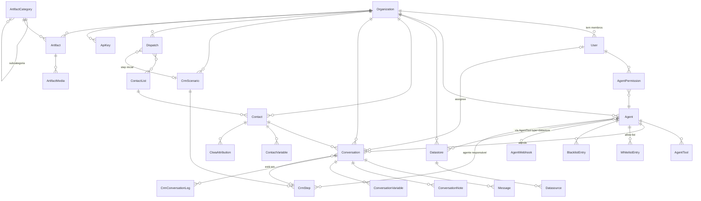

# Chatvolt — modelo de dados inferido

> **Inferido**, não documentado. Deduzido de schemas OpenAPI, respostas reais da
> API e semântica descrita na doc. Onde há dúvida, está marcado.
> Coleta: 2026-07-28.

## Convenções observadas

- **IDs `cuid`** — `cms4tfltf03h8uopj5rgadjfq_v3`. O sufixo `_v3` no ID do
  datastore sugere versionamento de índice embutido no identificador (provável
  migração de schema de vetor preservando o ID base).
- **Timestamps ISO 8601 UTC** — `2026-07-28T15:33:37.204Z`
- **`organizationId` em todo recurso** — tenancy carregada na linha, padrão
  equivalente ao nosso `empresa_id`
- **Enums em MAIÚSCULA** para domínio de negócio (`RESOLVED`, `HIGH`), minúscula
  para técnico (`qdrant`, `private`, `http`)
- Stack provável: **Prisma + PostgreSQL** (cuid é default do Prisma) com
  **Qdrant** para vetores

## Diagrama de entidades



## Entidades

### Organization

Unidade de tenancy e billing. Todo recurso carrega `organizationId`.

Campos inferidos: `id`, `name`, plano/limites, chaves BYOK (LLM, Groq,
ElevenLabs — a permissão "Llm Keys" indica armazenamento por organização).

### User

Membro da organização. Modelo de permissão em três camadas
([`01-mapa-funcional.md`](01-mapa-funcional.md#102-permissões-doc)):

```
User
├── isAdmin: boolean            ← curto-circuito: true = tudo liberado
├── pages: {                    ← permissões por módulo
│     inbox: { manageAllMessages, onlyViewHumanRequested },
│     settings: { apiKeys, billing, llmKeys },
│     agents: { view, create },
│     forms: { view, create },       ← módulo sem doc nem endpoint
│     datastores: { view, create, settings,
│                   datasources: { create, update, delete } },
│     contacts: { view },
│     analytics: { view }
│   }
└── agentPermissions: [ { agentId, view, update, delete } ]   ← por agente
```

A terceira camada (ACL por agente) é o que nosso RBAC não tem: nossas permissões
são por **tipo de recurso**, não por **instância**.

### Agent

| Campo | Origem |
|---|---|
| `id`, `organizationId` | `[LIVE]` |
| `name`, `description` | `[API]` |
| `modelName`, `temperature` | `[API]` |
| `systemPrompt` | `[API]` — texto único, sem versionamento exposto |
| `visibility` | `[API]` `public` \| `private` |
| `handle` | `[API]` slug para URL |
| `interfaceConfig` | `[API]` JSON do widget |
| `configUrlExternal`, `configUrlInfosSystemExternal` | `[API]` |
| `enableInactiveHours`, `inactiveHours` | `[API]` — **JSON por canal** |
| `iconUrl` | `[DOC]` |

Ausências que definem a arquitetura:

- **Sem `departmentId`.** Não há conceito organizacional no agente — fila e
  roteamento humano vivem no Flux CRM.
- **Sem versionamento de prompt.** Editar sobrescreve.
- **Sem vínculo direto com canal.** A ligação agente↔canal é feita pela aba
  Deploy, provavelmente numa tabela de integração à parte (`AgentIntegration`),
  já que um agente é "multicanal" na tabela de planos.

### AgentTool

```
id, agentId, type, config
type ∈ { http, datastore, mark_as_resolved, request_human,
         delayed_responses, follow_up_messages }
```

`config` é polimórfico por `type`. Para `http`: URL, método, headers, e array de
parâmetros com `{ type, isUserProvided, description, enum, value, items,
properties }` — o "Raw Mode" muda a interpretação desse array.

### Datastore `[LIVE]`

Único objeto do qual tenho resposta real completa:

```json
{
  "id": "cms4tfltf03h8uopj5rgadjfq_v3",
  "name": "Knowledge Base - Felipe",
  "description": null,
  "type": "qdrant",
  "autosync": true,
  "visibility": "private",
  "pluginIconUrl": null,
  "pluginName": "Knowledge Base - Fel",
  "pluginDescriptionForHumans": "About Knowledge Base - Felipe",
  "pluginDescriptionForModel": "Plugin for searching informations about ...",
  "config": {},
  "ownerId": null,
  "organizationId": "cms4tdvc201ohwvczxs4zti7v",
  "createdAt": "2026-07-28T15:33:37.204Z",
  "updatedAt": "2026-07-28T15:33:37.204Z",
  "_count": { "datasources": 0 }
}
```

Notas:

- `pluginName` **truncado em 20 chars** ("Knowledge Base - Fel") — resquício do
  limite de nome de plugin do ChatGPT
- `pluginDescriptionForModel` é gerado por template e serve para o LLM decidir
  entre múltiplos datastores
- `ownerId` distinto de `organizationId` — permite datastore pessoal
- `type` como campo sugere suporte a mais de um vector store, com Qdrant sendo o
  padrão

### Datasource

`id`, `datastoreId`, `type` (file, web_page, web_site, google_drive, youtube,
qa — inferido das fontes documentadas), `status` de sincronização, `config`.

O fine-tuning por correção cria datasource do tipo Q&A automaticamente.

### Conversation

Campos confirmados por spec e doc:

| Campo | Tipo | Nota |
|---|---|---|
| `id`, `organizationId`, `agentId`, `contactId` | string | |
| `channel` | enum | 12 valores — ver mapa funcional |
| `status` | enum | `RESOLVED` \| `UNRESOLVED` \| `HUMAN_REQUESTED` |
| `priority` | enum | `LOW` \| `MEDIUM` \| `HIGH` |
| `isAiEnabled` | boolean | **Estado explícito de handoff** |
| `assignee` | ref User | `assign` retorna 409 se ocupada, salvo `force` |
| `allowedUserIds` | array | **ACL por conversa** |
| `summary` | string | Derivado |
| `frustration` | number | 0–100, derivado |
| `tags` | array | |
| `scenarioId`, `stepId` | ref | Posição no funil |
| `processingJob`, `processingJobExpiresAt` | — | **Lease de processamento** |
| `createdAt`, `updatedAt` | timestamp | |

Duas descobertas relevantes:

**`processingJob` + `processingJobExpiresAt` é um lease** — mesmo mecanismo do
nosso `message_queue` (`FOR UPDATE SKIP LOCKED` + expiração). Confirma
processamento assíncrono com garantia de entrega, não invocação inline.

**`allowedUserIds` é ACL por linha de conversa**, mais granular que o nosso
`assigned_to_user_id` + `departamento_id`.

### ConversationVariable

```
conversationId, varName (≤ 20 chars), varValue (≤ 100 chars), updatedAt
```

Restrição de negócio importante: **o agente só recebe no prompt variáveis
atualizadas nos últimos 3 dias.** É janela de frescor, não TTL de storage — a
linha continua existindo, só sai do contexto.

### Contact + ContactVariable

`id`, `organizationId`, `name`, `email`, `phone`. Paginação por cursor.
Variáveis KV separadas das de conversa — persistem entre conversas.

### CtwaAttribution

Atribuição de anúncio Click-to-WhatsApp. Entidade própria, ligada a contato **e**
conversa:

```
id, contactId, conversationId, ctwaClid, sourceId, sourceType,
headline, body, sourceUrl, mediaType, imageUrl, videoUrl,
thumbnailUrl, clickedAt, createdAt, updatedAt
```

`ctwaClid` é o click ID da Meta — permite fechar o loop de conversão de volta no
Ads Manager. Entidade de marketing, não de atendimento.

### CrmScenario

`id`, `organizationId`, `name`, `showInactiveConversations` (boolean).

Regra de negócio: **conversa ativa em um cenário por vez**. Entrar no cenário Y
desativa no X. Implica tabela de junção com flag `active`, não FK simples.

### CrmStep

A entidade mais rica do sistema. Campos deduzidos da tela de configuração:

```
id, scenarioId, name, index
agentId                       -- agente responsável (nullable = mantém atual)
entryCondition                -- linguagem natural, avaliada por LLM
extraPrompt                   -- anexado ao prompt do agente neste step
entryMessage, entryMessageEnabled
isRequired                    -- conversa não pode pular
isRemovalStep                 -- sai do board ao entrar
requestContact: { name, email, phone }
autoNext: { enabled, time, unit, nextStepId }
defaults: {
  status, priority, aiControl (enable|disable|unchanged),
  tagsToAdd[], tagsToRemove[],
  assigneeLogic (none|specific|random_among_selected),
  eligibleTeams[], eligibleUsers[]
}
zapiNotification: { agentId, phoneNumber, message }
webhook: { url }
```

### CrmConversationLog

Trilha do caminho da conversa pelo funil. CRUD completo **incluindo `PATCH` e
`DELETE`** — log editável e apagável, o que o descaracteriza como trilha de
auditoria confiável.

### Dispatch + ContactList

```
Dispatch: id, organizationId, name, agentId, scenarioId, initialStepId,
          defaultStatus, scheduledAt, status (active|scheduled|completed)
ContactList: id, organizationId, name, contacts[]
DispatchContactListLink: dispatchId, contactListId   -- N:N
```

`populate-queue` como endpoint dedicado indica **fila materializada** de destinos
antes do envio.

Nenhum campo de opt-out, intervalo entre envios ou controle anti-ban aparece na
API.

### Artifact / ArtifactCategory / ArtifactMedia

```
ArtifactCategory: id, organizationId, name, parentId   -- auto-relação
Artifact:         id, categoryId, ..., active
ArtifactMedia:    id, artifactId, url, tipo
```

`DELETE /artifacts/{id}` documentado como "Delete **or Toggle**" implica campo
`active` com soft-delete.

Catálogo de produto estruturado — modelo de e-commerce, distinto de RAG.

### ApiKey

Uma por organização, sem escopo nem expiração documentados.

## Comparação com o nosso modelo

| Conceito | Chatvolt | Chat Nexus | Leitura |
|---|---|---|---|
| Tenancy | `Organization` | `empresa` | Equivalente. Nós temos **RLS no Postgres** (4 roles, 58 tabelas FORCE); eles filtram na aplicação |
| Conversa | `Conversation`, contínua por contato/canal | `atendimento`, com ciclo aberto→fechado | **Diferença de fundo.** Nosso modelo tem começo e fim; o deles é uma linha do tempo perpétua |
| Handoff | `isAiEnabled` booleano explícito | Derivado de `status` + `assigned_to_user_id` | O booleano é mais simples e não tem estado ambíguo — ver nota abaixo |
| Canal | Acoplado ao agente (Deploy) | `conexao`, entidade própria | **Nosso modelo é melhor** para multi-número |
| Base de conhecimento | Datastore → Datasource | `documento_conhecimento` → chunks, direto na empresa | Falta-nos o agrupador; sobra-nos chunking explícito |
| Fila de processamento | `processingJob` + expiração | `message_queue` com lease + `SKIP LOCKED` | Mesma solução |
| Variável de conversa | Entidade própria, janela de 3 dias | Não existe (temos `variavel_ambiente` por empresa e `coleta` por menu) | **Gap real** |
| ACL | Por instância de agente e de conversa | Por tipo de recurso, com `.own`/`.all` | Deles é mais granular; nosso é mais estruturado |
| Atribuição de anúncio | `CtwaAttribution` | Não existe | **Gap real** |

### A nota sobre handoff

O `isAiEnabled` deles é um booleano persistido e manipulável por API. O nosso
gate é **derivado** de `status == 'em_andamento' AND assigned_to_user_id IS NOT
NULL` (`worker/processor.py`).

Isso não é preferência estética. Estado derivado tem combinações que ninguém
previu — e uma delas é um bug conhecido nosso: após transferir para departamento,
o atendimento fica `aguardando` + `assigned = NULL`, as duas condições falham, e
a IA volta a responder numa conversa que já foi encaminhada para humano
(registrado em `gotcha_gate_ia_apos_transferencia`).

Um booleano explícito não teria esse modo de falha. É o achado de modelagem mais
acionável deste benchmark, e está no backlog como item de alto retorno.
